# SQL Basics


- SQL stands for Structure Query Language and is a relational database
- Relational db is a collection of tables 

## Commands
## QUERYING - SELECT operator
To query a table you can use the keyword `SELECT` to select for example a column from a table: 
```
SELECT name // select the column name
FROM people; // from the people table
``` 

Its good practice to keep keywords uppercase and to include a colon at the end of the query which tells SQL where the query ends 

* To select multiple column separate the column names with commmas: 
  * `SELECT name, birthdate FROM people;`
* To select all columns use the `*` 
* To limit the number of rows returned you can use the keyword `LIMIT` like so: 
  * `SELECT * FROM people LIMIT 10;`
* Use `DISTINCT` when you want to find all unique values like all languages for films 
* `COUNT` function can be used to return the number of rows in one or more columns 
  * To count "non-missing" values you can call `COUNT()` on just that column 
  * You can also combine `COUNT()` with `DISTINCT` to count number of distinct values in a column `SELECT COUNT(DISTINC birthdate) FROM people;`


In SQL, the `WHERE` keyword allows you to filter based on both text and numeric values in a table. There are a few different comparison operators you can use:
```
= equal
<> not equal
< less than
> greater than
<= less than or equal to
>= greater than or equal to
```
## FILTERING 
### WHERE operator
* `WHERE` keyword can be used to filter 

e.g.: 
```
SELECT *
FROM films
WHERE budget > 10000;
```
* You can use the `AND` keyword to add to the filtering like so: 
```
SELECT title
FROM films
WHERE release_year > 1994
AND release_year < 2000;
```  

### OR operator
* For selecting ros based on multiple conditions where some but not all conditions need to be met use the `OR` operator
* When combining AND and OR, be sure to enclose the individual clauses in parentheses, like so:

```
SELECT title
FROM films
WHERE (release_year = 1994 OR release_year = 1995)
AND (certification = 'PG' OR certification = 'R');
```

### BETWEEN operator
* The `BETWEEN` keyword provides a useful shorthand for filtering values within a specified range.
  
```
SELECT title
FROM films
WHERE release_year
BETWEEN 1994 AND 2000;
``` 

### NULL and NOT NULL 
* In SQL, `NULL` represents a missing or unknown value. You can check for `NULL` values using the expression `IS NULL`
* Check for `NULL`

```
SELECT COUNT(*)
FROM people
WHERE birthdate IS NULL;
```

* Check for not null
```
SELECT name
FROM people
WHERE birthdate IS NOT NULL;
```

## Aggregate Function 

### Avg, Min, Max and SUM
* AVG() function calculates the average of a specified column
* MIN() calculates the min
* MAX() calclulates the max
* SUM() function calculates the sum of a specified column


## Sorting and Grouping

### ORDER BY 
* In SQL, the ORDER BY keyword is used to sort results in ascending or descending order according to the values of one or more columns.
* By default ORDER BY will sort in ascending order. If you want to sort the results in descending order, you can use the DESC keyword.

```
SELECT title
FROM films
ORDER BY release_year DESC; //sorts Z-A
```

### GROUP BY
* In SQL, GROUP BY allows you to group a result by one or more columns
* Commonly, GROUP BY is used with aggregate functions like COUNT() or MAX(). Note that GROUP BY always goes after the FROM clause!
* Note that you must always list the column in the GROUP BY that is listed in the SELECT statement, otherwise SQL will throw an error

```
SELECT sex, count(*)
FROM employees
GROUP BY sex;
```
### HAVING
* HAVING allows you to filter based on the result of an aggregate function
* Using a WHERE operator is invalid

```
SELECT release_year
FROM films
GROUP BY release_year
HAVING COUNT(title) > 10;
```
---
# Introduction to Relational Databases
* Notes from [DataCamp Intro to Relational Databases](https://learn.datacamp.com/courses/introduction-to-relational-databases-in-sql)

## Relational Database: 
* Real-life entities become tables
* reduced redundanct 
* data integrity by relationships

Three Concepts learn from course: 
* Contraints
* Keys
* Referentia Integrity

## Information Schema
* Information schema is a schema that gives you information about your tables: `information_schema.tables` or `information_schema.columns`
* `information_schema` has multiple tables you can query with the known SELECT * FROM syntax:

tables: information about all tables in your current database
columns: information about all columns in all of the tables in your current database

### Entity relation diagram 
* Entity diagrams represent the entity and their associated data

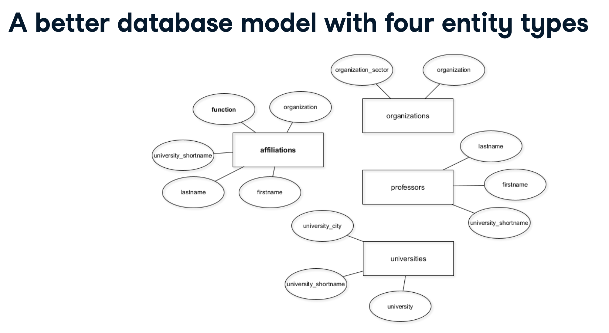

## LIST OF USEFUL COMMANDS
### CREATE TABLE command
* Include the table name, column name and data type for each column 

```
CREATE TABLE table_name (
 column_a data_type,
 column_b data_type,
 column_c data_type
);
```
### ALTER TABLE command
* To add columns to a db you can use `ALTER TABLE` command
```
ALTER TABLE table_name
ADD COLUMN column_name data_type;
```

### ALTER COLUMN 
* You can change the types of your column data using the `ALTER COLUMN` command
```
ALTER TABLE table_name
ALTER COLUMN column_name
TYPE varchar(10)
```

### INSERT DISTINCT INTO command
* Used to migrate data from one db to another and only copying distinct records
* Use the `DISTINCT` keyword to only mirgrate distinct values from one table to another ensuring no duplicates
```
INSERT INTO new_table_name
SELECT DISTINCT column_name 
FROM old_table_name
```

### INSERT INTO command
* The normal `INSERT` command used to insert data into a table 
```
INSERT INTO table_name (column1, column2, column3, ...)
VALUES (value1, value2, value3, ...);
```

### RENAME COLUMN
* Allowing you to rename a column name
```
ALTER TABLE table_name
RENAME COLUMN old_name TO new_name;
```

### DROP command
* Straight forward when there is no data 
* Can be used to drop columns or entire tables (USE WITH CAUTION)

Column:
```
ALTER TABLE table_name
DROP COLUMN column_name;
```  
Table: 
```
DROP TABLE table_name;
```

### USING command 
* You can use the `USING` command to perform operations like rounding down or truncating a string
---
## Integrity Contraints
There are three types of contraints:
1. Attribut contstraints, eg. data types on columns
2. Key constraints, eg primary keys
3. Referential integrity contraints, enforced through foreign keys

* Purpose of constraints:
  * Give data structure
  * Help with consistency and thus data quality
  * Data quality is business advantage/ data science prerequisite
  * Enforcing is difficult but SQL dbs can help

### Attribute Contraints 
* Data types as attribute constraints encforce data integrity
* Also restrict possible operations on the tables 
  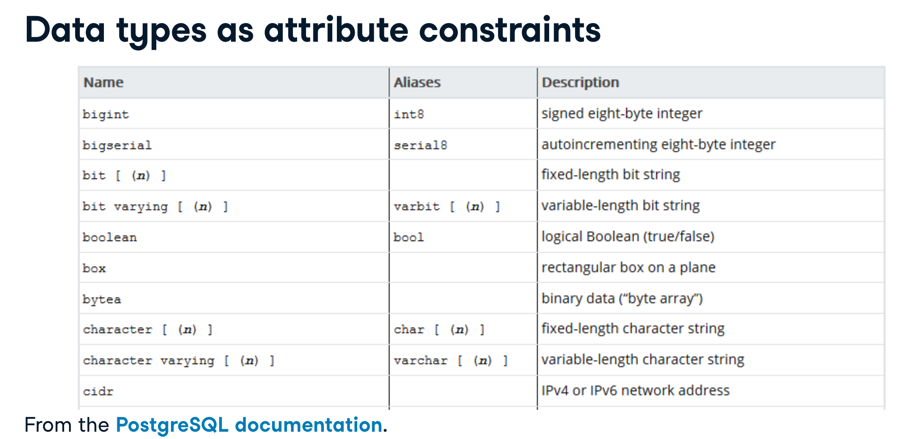

### Casting 
* If you want to do calculation for two columns with different types you can do CASTING on the fly. Do this if you know a certain columns stores numbers as text
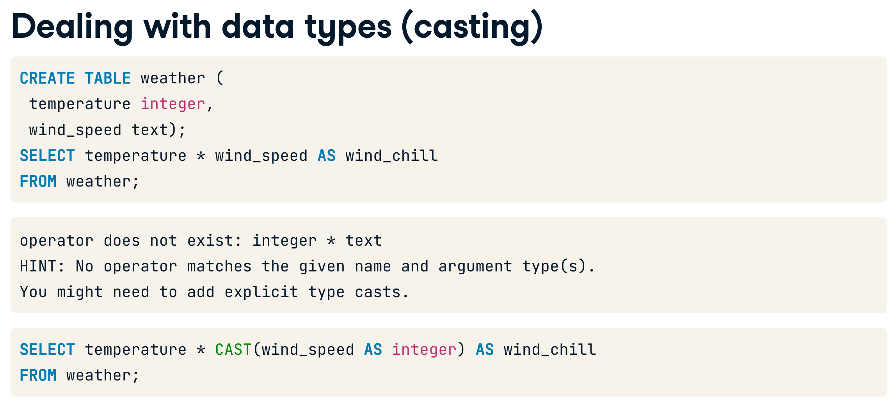

### Not-null contraint
* Disallow `NULL` valuesn in a certain column 
* Must hold true for current state and any future state
  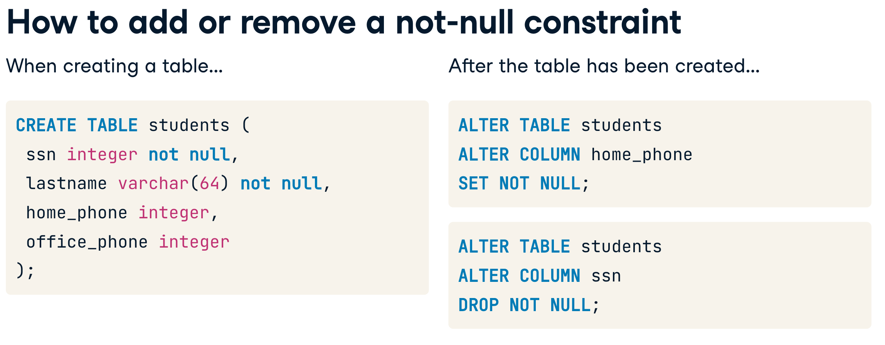
* What does null mean? 
  * unkonwn
  * does not exist yet
  * does not apply to the column


### Unique contstraint
* Disallow duplicate values in a column 
* Must hold true for current state and future state
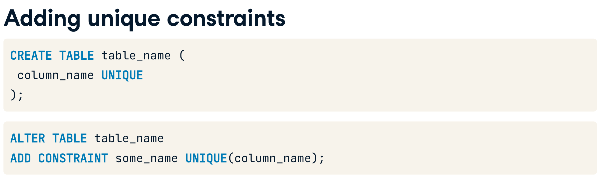  

## Keys and Superkeys
### What is a KEY? 
* Attributes that identity a record uniquely
* As long as attributes can be removed: superkey
* If no more attributes can be removed: minimal superkey or key
  
### Identify your keys with SELECT COUNT DISTINCT
One basic approach to finding the key for your table is to: 
1. Count the distinct records for all possible combinations of columns. If the resulting number x equals the number of all rows in the table for a combination, you have discovered a superkey.

2. Then remove one column after another until you can no longer remove columns without seeing the number x decrease. If that is the case, you have discovered a (candidate) key.
```
SELECT COUNT(DISTINCT(column_a, column_b, ...))
FROM professors;
```
### PRIMARY KEYS
* One primary key per database table, chosen from candidate keys
* Uniquely identifies records for referencing in other tables
* Unique and not-null constraints both apply
* Primary Keys are time-invariant: choose columns wisely
* Ideally primary keys exist with as few columns as possible

  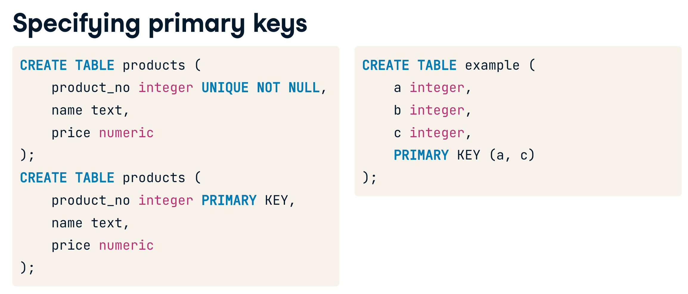
* Add primary key to an existing table: 
  ```
  ALTER TABLE table_name
  ADD CONSTRAINT some_name PRIMARY KEY (column_name)
  ```

### SURROGATE KEYS
* A surrogate key on a table is a column with a unique identifier for each row. The key is not generated from the table data
* Primary keys should be built from as few columns as possivle
* Primary keys should never change over time
* `SERIAL` tpye is used for primary key and sets new data to  auto-increment
  ```
  -- Add the new column to the table
  ALTER TABLE professors 
  ADD COLUMN id serial;

  -- Make id a primary key
  ALTER TABLE professors 
  ADD CONSTRAINT professors_pkey PRIMARY KEY (id);
  ```
* Another strategy to add a surrogate key is using `CONCAT()` function
  ```
  -- Update id with make + model
  UPDATE cars
  SET id = CONCAT(make, model);

  -- Make id a primary key
  ALTER TABLE cars
  ADD CONSTRAINT id_pk PRIMARY KEY(id);
  ```
## Foreign Keys

* A foreign key (FK) points to the primary key of another table
* domain of FK must be equal to domain of PK
* Each value of FK must exist in PK of the other table (FK constraint or "referential integrity")
* FK are not actual keys - because duplicates and null values are allowed 

Specifying foreign keys
* Use the `REFERENCES` keyword 
* When using foreign keys it allows you to ensure entries inserted into the the table with the foreign key exist in table b - the "foreign key contraint" 
* You use a foreign key when you model a 1:n relationship 

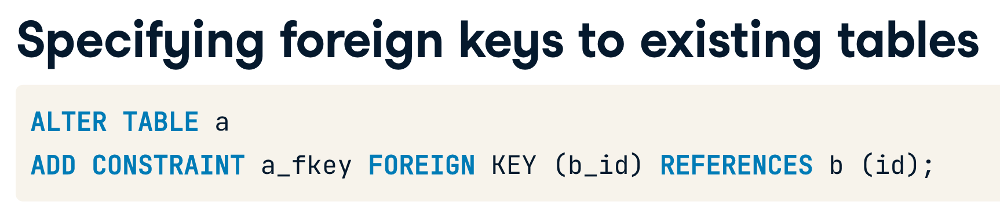
OR: 
```
ALTER TABLE a
ADD COLUMN b_id integer REFERENCES b (id);
```

### N:M relationships
* When you have a relationship where entities can have many to many like professors with organizations you establish a n:m relationship
* Create a table that contains two foreign keys that point to two connected entities
* Add foreign keys for every connected table
* Add additional attributes could be included 
* No primary key is defined 

You can use the `UPDATE` command to update columns in a table based on values in another table
```
UPDATE table_a
SET column_to_update = table_b.column_to_update_from
FROM table_b
WHERE condition1 AND condition2 AND ...;
```

## Referential Integrity
* A record referencing another table must refer to an existing record in that table 
* Contraint that always concerns two tables and is enforced through foreign keys 
* Can be violated in two ways: 
  * if a record in table B that is referenced from a record in table A is deleted 
  * if a record in table A referencing a non-existing record from table B is instered
* That is the main reason for Foreign Keys

### Dealing with violations
* No Action: Throw an error
* Cascade: Delete all referencing records
* RESTRICT: Throw an error
* SET NULL: set the referencing column to NULL 
* SET DEFAULT: Set the referencing column to its defaul value
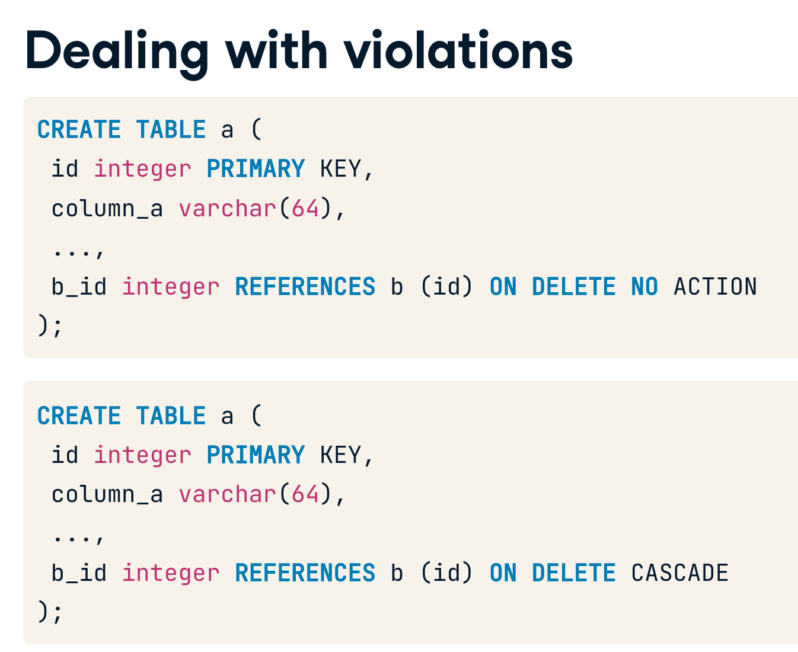

* You can query your DB for table_constraints by running: 
  ```
  SELECT constraint_name, table_name, constraint_type
  FROM information_schema.table_constraints
  WHERE constraint_type = 'FOREIGN KEY';
  ```
* TO update a foreign key contraint you first have to `DROP` the contraint and then add a new one like so: 
  ```
  -- Drop the foreign key constraint
  ALTER TABLE affiliations
  DROP CONSTRAINT affiliations_organization_id_fkey;

  -- Add a new foreign key constraint from affiliations to organizations which cascades deletion
  ALTER TABLE affiliations
  ADD CONSTRAINT affiliations_organization_id_fkey FOREIGN KEY (organization_id) REFERENCES organizations (id) ON DELETE CASCADE;
  ```

## WRAP UP
* In the beginning of the course we started with one table with redundant data and added primary keys, foreign keys and data types
  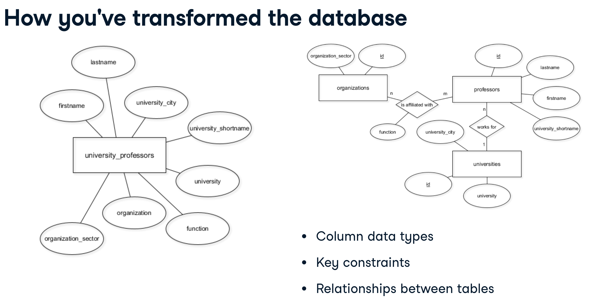
---
# Databse Design
* Notes from [DataCamp Databse Design](https://campus.datacamp.com/courses/database-design) course

* Questions to be answered: How to oranganize our data? 
## OLTP and OLAP

__OLTP__: Online Transaction Processing
  - Oriented around transactions
  - Focuses on day-to-day transactions

When to use OLTP?
  - Finding the prices of a book
  - Update latest customer transaction
  - Keep track of employee hours

__OLAP__: Online Analytical Processing
  - Oriented around analytics 
  - Focuses on business desicion making 
  
 When to use OLAP
  - Calculate books with best profit margin
  - Find most loyal customer
  - Decide employee of the month 

### OLTP vs. OLTP
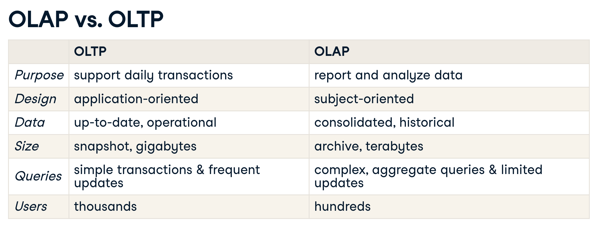

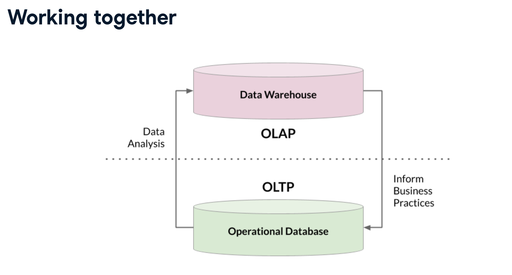

## Storing Data
Stored in three ways
1. Structed data
   1. Follows a schema
   2. Designed data types & relationships
2. Unstructured Data
   1. Media files and raw text
   2. Schemaless
3. Semi-structured data
   1. Does not follow larger schema
   2. Self-describing structure
   3. E.G JSON, XML and NoSql


### Traditional DBs
* Storing real-time relational structed data - OLTP

### Data Wharehouses
* For analyzing archived structed data - OLAP
* Optimized for read-only analytics - OLAP
* Usually read-only
* Contains data from multiple sources
* Massively parallel processing
* Typically uses a denormalized schema and dimensional modeling
  * EG Azure SQL Data Warehouse and Amazon Redshit
* Schema-on-write
### Data Lakes
* For storing data of all structures = flexibility and scalabilitty
* For analyzing big data
* Storage is cheaper
* Retains all data and can take up petabytes
* Schema-on-read
* Need to catalog data otherwise becomes a data swamp
* Run big data analytics using services like Apache Spark and Hadoop

When should you choose a data lake over a data warehouse? 
* To create accessible and isolated data repositories for other analysts

## Data Flows
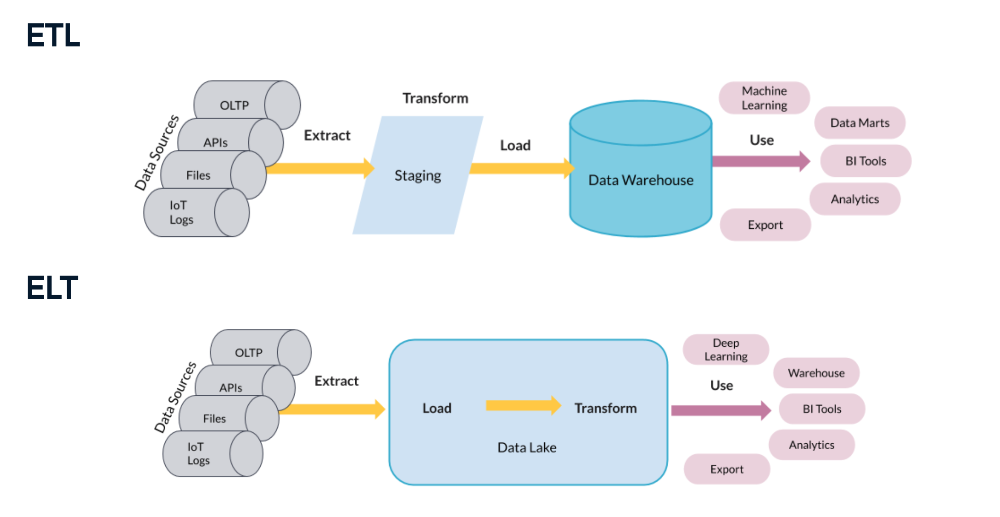  
  
## What is DB design 
* Determines how data is logically stored
* Uses db models: hih-level specifications for the db structure
  * Most popular is relational model 
  * Others are: NoSQl, Object oriented or network model
* Uses Schemas: blueprint of the db 
  * defines tables, fields, relationships, indexes and views
  * When inserting dat in relational db, schemas must be respected

## Data Model 
* [Abstract model](https://en.wikipedia.org/wiki/Data_model) that organizes elements of data and standardizes how they relate to one another
* Process of creating a data model for the data to be stored
* Three levels of data modeling: 
    1. Conceptual data model: describes entities, relationships and attributes
       1. Tools: data structure diagrams e.g. entity-relational diamgrams and UML diagrams
    2. Locigal data model: defines tables, columns and relationships
       1. Tools: database models and schemas, e.g. relational model and star schmea
    3. Physical data model: describes physical storage 
       1. Tools: partitions, CPUs, indexes, backup systems and tablespaces


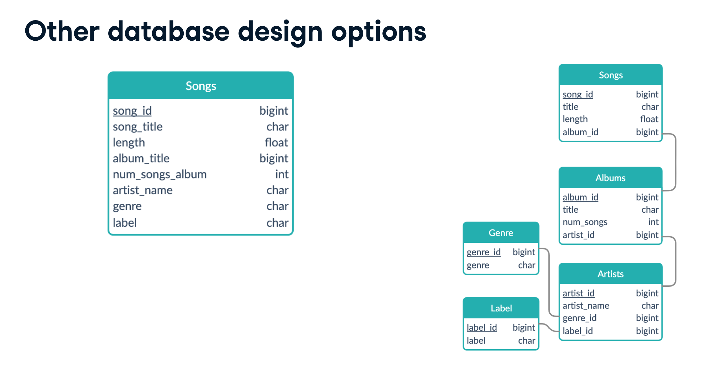


### Dimensional modeling
It is the adaptation of the relational model for data warehouse design 
* Optimized for OLAP: queires: aggregate data, not updating
* Builting using star schema 
* Easy to interpret and extend 
* Dimensional modeling us two tables: 
  1. Fact tables
      * Decided by business use-case
      * Holds records of a metric
      * Changes Regularly
      * Connects to dimensions via foreign keys
  2. Dimension tables
      * Holds descriptions of attributes
      * Does not change as often
  
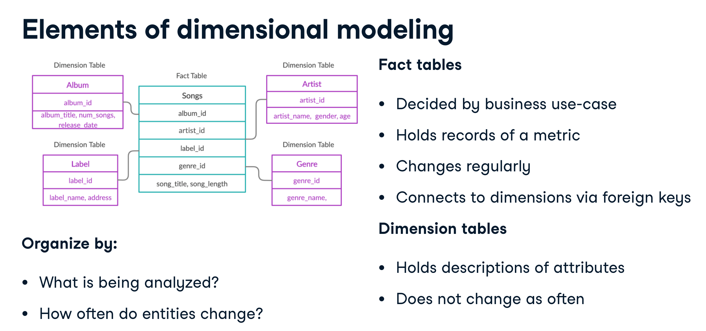

## Star and Snowflake Schema 
* Star is simmplest dimensional modeling type and is often called 'dimensional modeling'
* Snowflake schema is an extension of the star schema 
  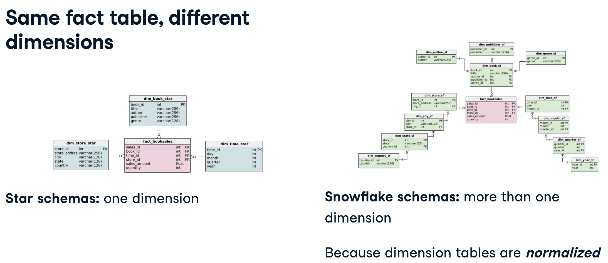
    * The snowflake schema is typically faster to extend while ensuring data consistency

### Data nomalization
* Database design technique
* Divides tables into smaller tables and connects them via relationships
* Goal: Reduce redundnacy and increase data integrity
* It happens via identify repeating groups of data and create new tables for them

### Adding Foreign Keys
* Correctly setting up the foreign keys, in Star and Snowflake schema is vital because they connect dimensions to the fact table. They also enforce a one-to-many relationship, because unless otherwise specified, a foreign key can appear more than once in a table and primary key can appear only once.
 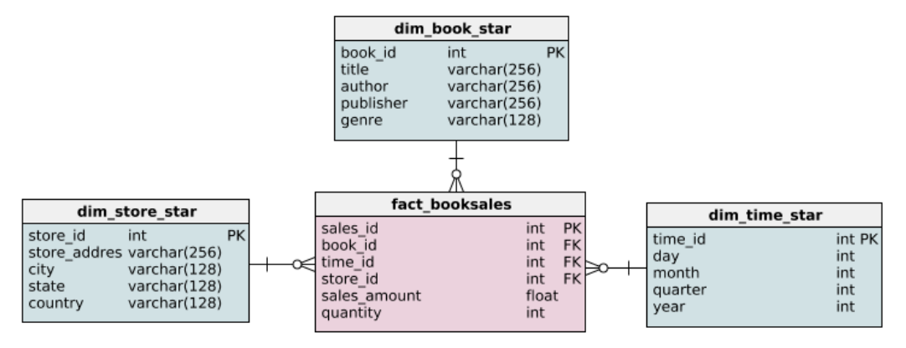
 E.g: Adding a foreign key: 
 ```
 ALTER TABLE <table_name> ADD CONSTRAINT <constraint_name>
    FOREIGN KEY (<id_name>) REFERENCES <dim_table> (<id_name>);
  
  ALTER TABLE fact_booksales ADD CONSTRAINT sales_book
  FOREIGN KEY (book_id) REFERENCES dim_book_star (book_id);
```

## Normalized and denormalized DBs
* Star schemas can be denormalized while Snowflake schemas are considered to be Normalized 
* Normalized schemas are more complicated
  * Have more tables and more joins which means slower queries 
* Pros: Normalization saves space and eliminates data redundancy
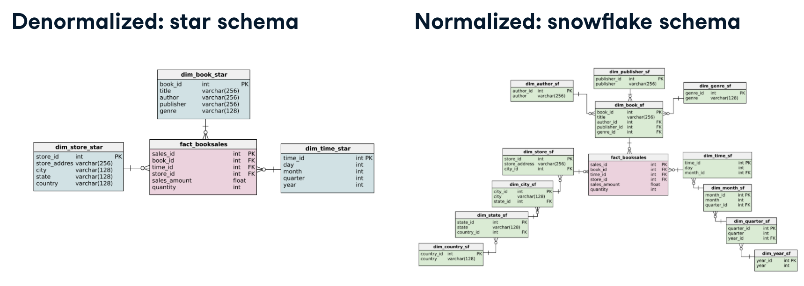
### Normalization  
1. Ensures better data integrity 
2. Enforces data consistency 
     * Must resepect naming convention because of referential integrity
3. Safer updating, removing and inserting 
     * Less data redundancy = less records to alter 
4. Easier to redesign by extending 
     * Smaller tables are easier to extend  

Pros vs. Cons of Normalization
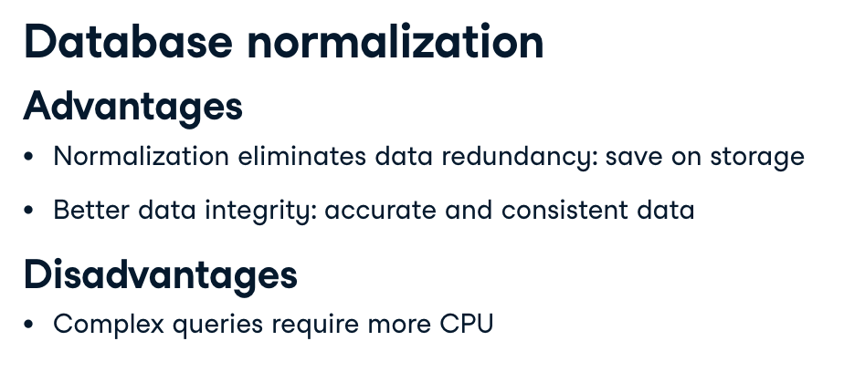
* Also another disadvantage is that indexing and reading of data slower
* Deciding whether to use normalization comes down to how read/write intensive your data is going to be 

OLTP vs. OLAP and what type of schema should be used


## Normal Forms
* Simple def: Identify repeating groups of data and create new tables for them
* More formal definition, goals are to: 
  * Be able to characterize the level of redundancy in a relational schema 
  * Provide mechanisms for tansforming schemas in order to remove redundancy

### List of Normal Forms
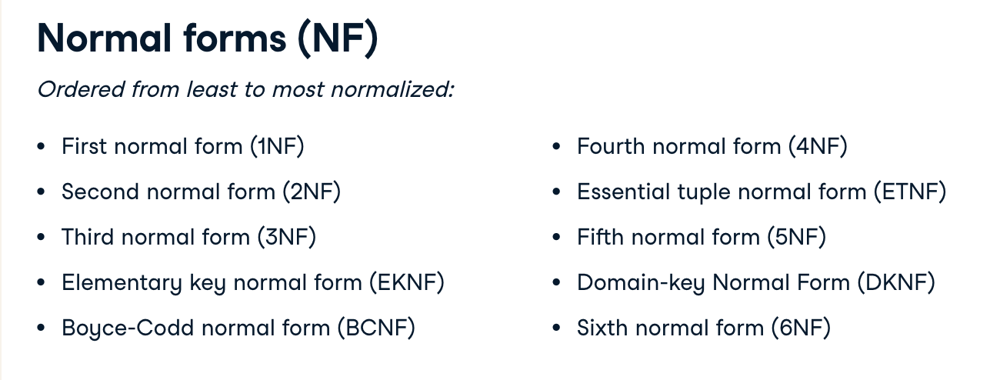

### 1NF Rules
* Each record must be unique - no duplicate rows 
* Each cell must hold one value    

### 2NF Rules
* Must satisfy 1NF AND
  * If primary key is one column 
    * then automatically satisfies 2NF
  * If there is a composite primary key
    * then each non-key column must be dependent on all the keys

### 3NF 
  * Satifies 2NF
  * No transitive dependencies: non-key columns can't depend on other non-key columns

### Data anomolies 
What is risked if we don't normalize enough? 
1. Update anomaly
2. Insertion anomaly
3. Deletion anomaly

The more normalized a db the less prone it will be to data anomolies 
#### Update Anomoly
* Data inconsistency caused by data redundancy when updating

#### Insertion Anomoly
* Unable to add a record due to missing attributes
  
#### Deletion Anomaly  
* Delete of record(s) causes unintential loss of data


## Database Views 
* In a DB, a view is the result set of a stored query on the data, which the db users can query just as they would in a persistent database collection object
* They are a virtual table that is not part of the physical schema 
* The query, not the data is stored in memory
* Data is aggregated from data in tables
* Can be queried like a regular db table
* No need to retype common queries or alter schemas

### Create a view 
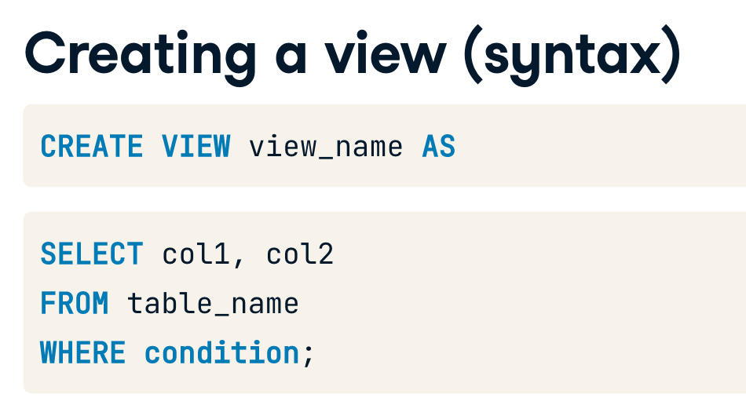

To view all views in your DB you can run: 
`SELECT * FROM INFORMATION_SCHEMA.views;` // specific to PostgreSQL

### Benefits of views
* Doens't take up storage
* A form of access control 
  * hide sensitive columns and retrict what user can see
* Masks complexity of queries
  * Useful for highly normalized schemas 

## Managing Views
* 

  